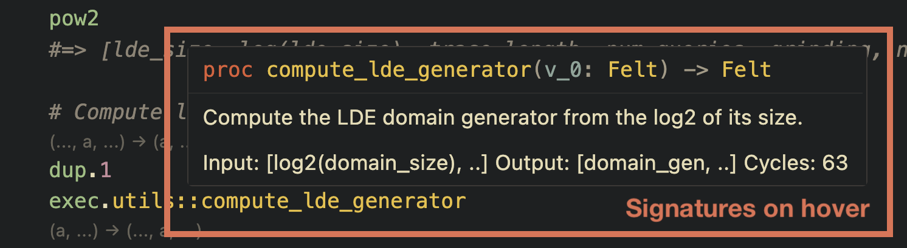
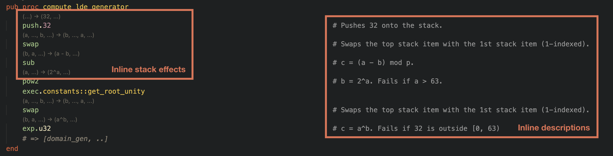
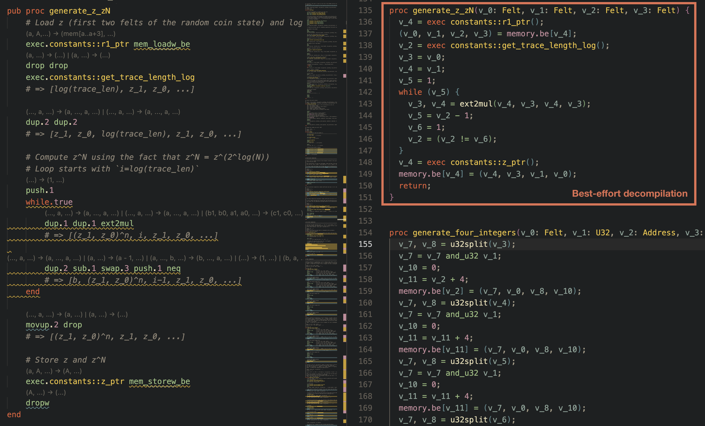

# MASM VS Code Extension

VS Code LSP client for the Miden assembly language (MASM) powered by the [`masm-lsp`](https://github.com/trailofbits/masm-lsp) language server.

## Features

The extension provides:

- Syntax highlighting for `.masm` files.
- Goto symbol definitions and find references.
- Constant and procedure documentation on hover (including signatures).
  <div style="margin:1em">
    
  </div>
- Inline descriptions for all MASM instructions.
  <div style="margin:1em">
    
  </div>
- Best-effort side-by-side decompilation of procedures.
  <div style="margin:1em">
    
  </div>
- Diagnostics for inconsistent stack effects, insufficient type validation, and invalid procedure signatures.

## Commands

The extension provides the following commands (accessible via the Command Palette):

| Command                               | Description                                                    |
| ------------------------------------- | -------------------------------------------------------------- |
| `MASM: Open Pseudocode in New Window` | Decompile the current file and open the result in a new window |
| `MASM: Toggle Inline Decompilation`   | Enable or disable inline procedure decompilation               |
| `MASM: Toggle Inline Descriptions`    | Enable or disable inline instruction descriptions              |
| `MASM: Toggle Stack Effects`          | Enable or disable inline stack effect hints                    |
| `MASM: Set Inline Hints Position`     | Set the column to align inline hints to                        |
| `MASM: Restart Language Server`       | Restart the LSP server                                         |

## Requirements

- `masm-lsp` binary available on your `PATH` (or configure `masm-lsp.serverPath`).
- Node.js 18+ for running/building the extension.

## Development

To build and package the extension, run the following commands:

```bash
cd vscode-masm
npm install      # To install dependencies
npm run compile  # To compile the extension
npm run package  # To package the extension into a .vsix file
```

The resulting `.vsix` file can be installed in VS Code via the "Extensions: Install from VSIX" command.

### Configuration

- `masm-lsp.serverPath`: absolute path or command name for the LSP binary (defaults to `masm-lsp`).
- `masm-lsp.trace.server`: LSP trace level (`off`, `messages`, `verbose`).
- `masm-lsp.corePath`: Absolute path to the MASM core library in the 0xMiden/miden-vm repository. If empty, the extension will attempt to infer it from the workspace or prompt you. When omitted entirely, the server will auto-clone a copy.
- `masm-lsp.inlayHints.position`: column to align inlay hints to. If 0, hints use minimum padding only. If the line extends past this column, minimum padding is used instead.
- `masm-lsp.inlayHints.minimumPadding`: minimum number of spaces between source code and inlay hints.
